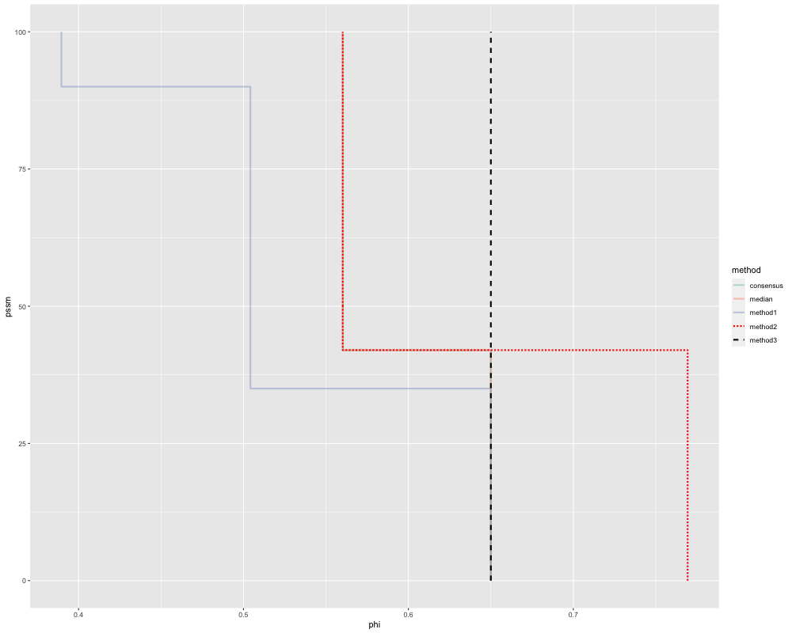
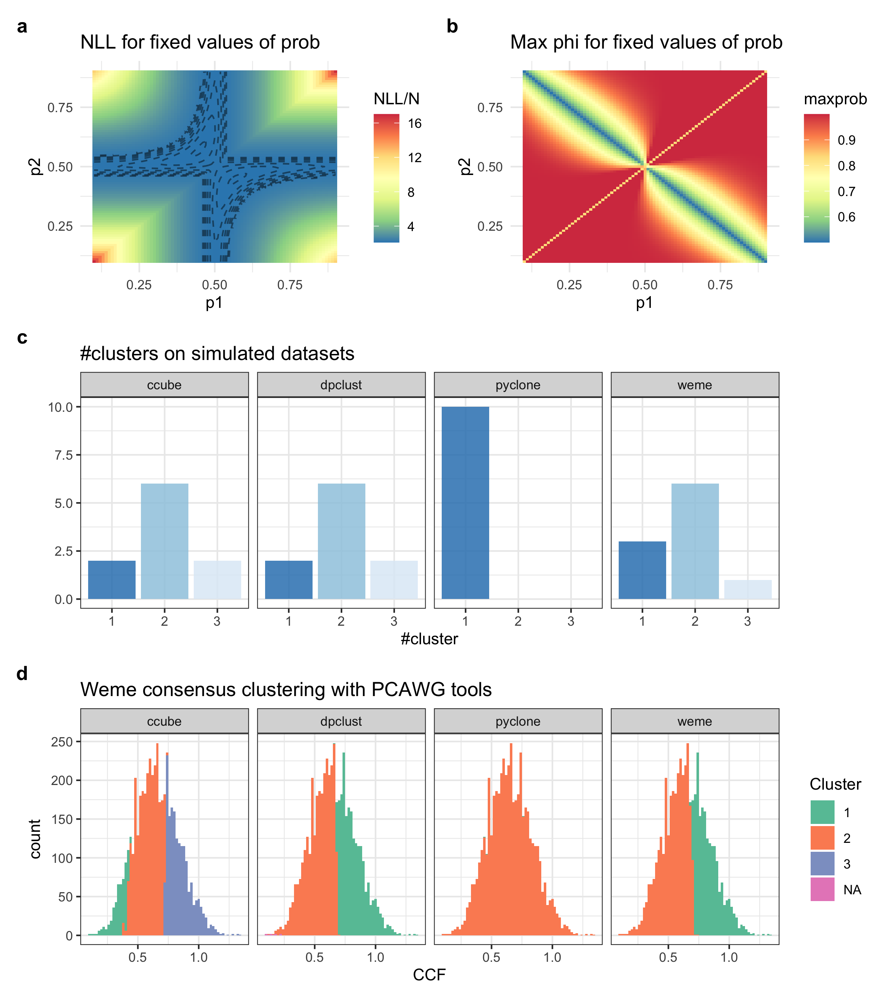

**Other required packages.**

```{r, message=FALSE, results='hide', echo=FALSE}
set.seed(1234)

# Used packages
require(dplyr)
require(readr)
library(tidyverse, quietly = TRUE)

# Models
require(VGAM)
require(ccube)
require(mclust)
require(fpc)
require(matrixStats)

# Plots
library(patchwork)
require(ggplot2)
require(cowplot)

# Weme source code
source("./weme.R")
```

## Example dataset

We generated a simulated dataset assuming:

<<<<<<< HEAD
- a beta binomial density;
- coverage $45$;
- overdispersion $\rho~0.019$. 
- a mnoclonal tumour, i.e., with just the clonal cluster;
- $80\%$ purity. 

All these values are well representative of the PCAWG data quality for the right tail of overdispersion values.

```{r}
# Parameters
COVERAGE <- 45
N <- 10000
PURITY  <-  0.8
```


Synthetic read-counts.

```{r}
simulate_data = function(overdispersion = 0.01,
                         N = 1000,
                         coverage = rpois(N, 45), seed = 3, purity = 1)
{
  data.frame(
    DP = coverage,
    NV = VGAM::rbetabinom(
      n = N,
      size = coverage,
      prob = 0.5 * purity,
      rho = overdispersion
    )
  ) %>%
    mutate(VAF = NV / DP)
}
```


```{r}
# Poisson-distributed coverage

rhos <- readr::read_tsv("../rho_selected_cases.tsv")

# we get a tail value
overdispersion <- rhos$rho %>% quantile(0.95)

N = N
coverage = rpois(N,lambda = COVERAGE) %>% round()

input = simulate_data(overdispersion = overdispersion,
                      N = N,
                      coverage = coverage, seed = seed, purity = PURITY)
input$chr = 1
input$position = sample.int(n = 1e8, replace = F, size = nrow(input))
input$overdispersion = overdispersion

```
Synthetic data plots
```{r}
hist(input$DP)
hist(input$NV)
hist(input$NV/input$DP, breaks = 60) # VAF
=======
- a negative binomial density;
- coverage $50$;
- overdispersion $\rho=0.015$. 
- a mnoclonal tumour, i.e., with just the clonal cluster;
- $65\%$ purity. 

All these values are well representative of the PCAWG data quality.

```{r}
# Parameters
MEAN_COV <- 45
#RHO <- 0.015
N <- 3000
purity  <-  0.50
p_clonal <- 9/10
p_tail <- 1/10
```

Synthetic read-counts.
```{r}
# Poisson-distributed coverage
# small residual tail
DP_clonal <-  rpois(round(N * p_clonal), MEAN_COV)

DP_tail <-  rpois(round(N * p_tail), MEAN_COV)

# Beta-Binomial reads with the variant
NV_clonal <- rbetabinom(round(N * p_clonal) , size = DP_clonal, prob = purity * 0.5, rho = RHO)

NV_tail <- rbetabinom(round(N * p_tail), size = DP_tail, prob = VGAM::rtruncpareto(n = round(N * 1/5), 0.05,purity * 1, shape = 2), rho = RHO)

DP <- c(DP_tail, DP_clonal)
NV <- c(NV_tail, NV_clonal)

tom <- NV > 0
NV <- NV[tom]
DP <- DP[tom]

# Random genomic coordinates
chr <- rep(1, sum(tom))

position <- sample.int(1e8, size = sum(tom), replace = T) %>% sort()

# Data
inp <-  data.frame(chr, position, DP, NV, VAF = NV /DP)
save(inp, file = "input_data.rda")
nrow(inp)
```
Synthetic data plots
```{r}
hist(DP)
hist(NV)
hist(NV/DP, breaks = 100) # VAF
<<<<<<< HEAD
>>>>>>> 0deecbe0cfefa5af09b4a568f992ccadefbc0301
=======
>>>>>>> b56aa614b7bc9492389f4b320805508d167fc58d
```

# Ccube analysis (normal-binomial, variational)

We run ccube as in the vignette with 5 repetitions

```{r, eval = FALSE}
numOfClusterPool = 1:6
numOfRepeat = 5

# Format
ccube_inp <- data.frame(
  major_cn = 1,
  minor_cn = 1,
  total_cn = 2,
<<<<<<< HEAD
  purity = PURITY,
  normal_cn = 2,
  mutation_id = paste(input$chr, input$position, sep = "_"),
  var_counts = input$NV,
  ref_counts = input$DP - input$NV,
  total_counts = input$DP
=======
  purity = purity,
  normal_cn = 2,
  mutation_id = paste(chr, position, sep = "_"),
  var_counts = NV,
  ref_counts = DP - NV,
  total_counts = DP
>>>>>>> 0deecbe0cfefa5af09b4a568f992ccadefbc0301
) %>% as_tibble()

# Fit
results_ccube <- RunCcubePipeline(
  ssm = ccube_inp,
  numOfClusterPool = numOfClusterPool,
  numOfRepeat = numOfRepeat,
  runAnalysis = T,
  runQC = T, multiCore = T
  
)

# Save results
save(results_ccube, file = "results_ccube.rda")
```

Inspect results - standard Ccube visualisation. Recall that there should be only 1 single-cluster in this deconvolution.
```{r}
load("results_ccube.rda")

MakeCcubeStdPlot(ssm = results_ccube$ssm, res = results_ccube$res)
```

# DPClust analysis (binomial, Monte Carlo)

Prepare inputs.

<<<<<<< HEAD
```{r, eval=FALSE}
dir.create("dpclust_input", showWarnings = FALSE)

data.frame(
  chr = input$chr,
  end = input$position,
  Reference_Allele = "A", # Made up, do not affect results
  Tumor_Seq_Allele2 = "T",
  mut.count	 = input$NV,
  WT.count = input$DP - input$NV,
=======
```{r}
dir.create("dpclust_input", showWarnings = FALSE)

data.frame(
  chr = chr,
  end = position,
  Reference_Allele = "A", # Made up, do not affect results
  Tumor_Seq_Allele2 = "T",
  mut.count	 = NV,
  WT.count = DP - NV,
>>>>>>> 0deecbe0cfefa5af09b4a568f992ccadefbc0301
  subclonal.CN	 = 2,
  mutation.copy.number	 = 1,
  subclonal.fraction	 = 1,
  no.chrs.bearing.mut	= 1
) %>%
  readr::write_tsv(., "dpclust_input/sample0_input.txt")

data.frame(
  sample = "sample0",
  subsample = "01",
  datafile = "./sample0_input.txt",
<<<<<<< HEAD
  cellularity = PURITY
=======
  cellularity = purity
>>>>>>> 0deecbe0cfefa5af09b4a568f992ccadefbc0301
) %>%
  readr::write_tsv(., "dpclust_input/sample0.txt")
```

For DPClust we use the pipeline that can be found in the package, it is also available as a docker image. The code below is not run by this markdown.

```{bash, eval = FALSE}

source ~/.bashrc

mkdir -p output_dpclust
cd dpclust/inst/example

<<<<<<< HEAD
<<<<<<< HEAD
module load R/4.1.0
=======
module load R
>>>>>>> 0deecbe0cfefa5af09b4a568f992ccadefbc0301
=======
module load R
>>>>>>> b56aa614b7bc9492389f4b320805508d167fc58d

R --vanilla --slave -q -f dpclust_pipeline.R --args -r 1 -d ../../../dpclust_input/ -o ../../../output_dpclust -i ../../../dpclust_input/sample0.txt

```

Assemble results, and print outputs.
<<<<<<< HEAD
```{r, eval=FALSE}
=======
```{r}
>>>>>>> 0deecbe0cfefa5af09b4a568f992ccadefbc0301
cluster_composition_dpclust <-
  readr::read_tsv(
    "output_dpclust/sample0_DPoutput_2000iters_1000burnin_seed123/sample0_2000iters_1000burnin_bestClusterInfo.txt",
    col_types = cols()
  )

print(cluster_composition_dpclust)
```

# Pyclone-VI analysis (beta-binomial, variational)

Create inputs.
<<<<<<< HEAD
```{r, eval=FALSE}
dir.create("pyclone_input", showWarnings = F)

data.frame(
  mutation_id = paste0("S_", 1:length(input$DP)), # indifferent
  sample_id = "example",
  alt_counts	 = input$NV,
  ref_counts = input$DP - input$NV,
  normal_cn	 = 2,
  major_cn	 = 1,
  minor_cn	= 1,
  tumour_content = PURITY
=======
```{r}
dir.create("pyclone_input", showWarnings = F)

data.frame(
  mutation_id = paste0("S_", 1:length(DP)), # indifferent
  sample_id = "example",
  alt_counts	 = NV,
  ref_counts = DP - NV,
  normal_cn	 = 2,
  major_cn	 = 1,
  minor_cn	= 1,
  tumour_content = purity
>>>>>>> 0deecbe0cfefa5af09b4a568f992ccadefbc0301
) %>%
  readr::write_tsv(., "pyclone_input/sample0_input.tsv")
```

Fit is run through the conda environment previously created. 
```{bash,eval = FALSE}
<<<<<<< HEAD
=======
## you don't have to do this if you use the docker
<<<<<<< HEAD
>>>>>>> 0deecbe0cfefa5af09b4a568f992ccadefbc0301
=======
>>>>>>> b56aa614b7bc9492389f4b320805508d167fc58d
source /home/salvatore.milite/miniconda3/etc/profile.d/conda.sh

conda activate pyclone-vi

mkdir output_pyclone

pyclone-vi fit -i pyclone_input/sample0_input.tsv -o output_pyclone/example.h5 -c 40 -d beta-binomial -r 10

pyclone-vi write-results-file -i output_pyclone/example.h5 -o output_pyclone/example.tsv
```

# Mclust + merging (gaussian + post hoc correction)

The CCF calculation here is trivial (no need for Bayclone)
<<<<<<< HEAD
<<<<<<< HEAD
```{r, eval=FALSE}

ccf <- input$VAF * 2
=======
```{r}

ccf <- inp$VAF * 2
>>>>>>> 0deecbe0cfefa5af09b4a568f992ccadefbc0301
=======
```{r}

ccf <- inp$VAF * 2
>>>>>>> b56aa614b7bc9492389f4b320805508d167fc58d

```

We then run mclust with the same parameters used in the Dentro paper and correct the result with `mergenormals`

<<<<<<< HEAD
<<<<<<< HEAD
```{r, eval=FALSE}

library(mclust)

res_mclust <- Mclust(ccf, G = 1:8)
=======
=======
>>>>>>> b56aa614b7bc9492389f4b320805508d167fc58d
```{r}

library(mclust)

res_mclust <- Mclust(ccf, G = 1:7)
<<<<<<< HEAD
>>>>>>> 0deecbe0cfefa5af09b4a568f992ccadefbc0301
=======
>>>>>>> b56aa614b7bc9492389f4b320805508d167fc58d

summary(res_mclust)
```

<<<<<<< HEAD
<<<<<<< HEAD
```{r, eval=FALSE}
=======
```{r}
>>>>>>> 0deecbe0cfefa5af09b4a568f992ccadefbc0301
=======
```{r}
>>>>>>> b56aa614b7bc9492389f4b320805508d167fc58d
library(fpc)

dir.create("mclust_out")

<<<<<<< HEAD
<<<<<<< HEAD
if(res_mclust$G > 1){
  
  res_mclust_merged <- mergenormals(ccf,res_mclust, method = "ridge.uni")
  
  sm <-  summary(res_mclust_merged)
  
  data.frame(id = 1:length(sm$clusternumbers), n_ssm = sm$clustering %>%  table() %>%  as.numeric(), loc = sm$muarray) %>% readr::write_tsv("mclust_out/mclust_subclonal_structure.tsv")
  
  data.frame(clusters = sm$clustering) %>% readr::write_tsv("mclust_out/mclust_clusters.tsv")
  
  data.frame(id = 1:length(sm$clusternumbers), n_ssm = sm$clustering %>%  table() %>%  as.numeric(), loc = sm$muarray)

} else {
  
  data.frame(id = 1:length(res_mclust$G), n_ssm = res_mclust$classification %>%  table() %>%  as.numeric(), loc = res_mclust$parameters$mean) %>% readr::write_tsv("mclust_out/mclust_subclonal_structure.tsv")
  
  data.frame(clusters = res_mclust$classification) %>% readr::write_tsv("mclust_out/mclust_clusters.tsv")
  
  data.frame(id = 1:length(res_mclust$G), n_ssm = res_mclust$classification %>%  table() %>%  as.numeric(), loc = res_mclust$parameters$mean)
  
}


=======
=======
>>>>>>> b56aa614b7bc9492389f4b320805508d167fc58d
res_mclust_merged <- mergenormals(ccf,res_mclust, method = "ridge.uni")

sm <-  summary(res_mclust_merged)

data.frame(id = 1:length(sm$clusternumbers), n_ssm = sm$clustering %>%  table() %>%  as.numeric(), loc = sm$muarray) %>% readr::write_tsv("mclust_out/mclust_subclonal_structure.tsv")

data.frame(clusters = sm$clustering) %>% readr::write_tsv("mclust_out/mclust_clusters.tsv")

data.frame(id = 1:length(sm$clusternumbers), n_ssm = sm$clustering %>%  table() %>%  as.numeric(), loc = sm$muarray)
<<<<<<< HEAD
>>>>>>> 0deecbe0cfefa5af09b4a568f992ccadefbc0301
=======
>>>>>>> b56aa614b7bc9492389f4b320805508d167fc58d
```


# CliP (Binomial)

As the author propose a `bootstrap log-likelihood ratio test to select the penalizing parameter` but the code is not released in the official GitHub, we use BIC to select the best model as suggested two lines above.

<<<<<<< HEAD
<<<<<<< HEAD
```{r, eval=FALSE}
dir.create("clip_input", showWarnings = FALSE)

data.frame(
  chromosome_index = input$chr,
  position = input$position,
  alt_count	 = input$NV,
  ref_count = input$DP - input$NV
=======
=======
>>>>>>> b56aa614b7bc9492389f4b320805508d167fc58d
```{r}
dir.create("clip_input", showWarnings = FALSE)

data.frame(
  chromosome_index = chr,
  position = position,
  alt_count	 = NV,
  ref_count = DP - NV
<<<<<<< HEAD
>>>>>>> 0deecbe0cfefa5af09b4a568f992ccadefbc0301
=======
>>>>>>> b56aa614b7bc9492389f4b320805508d167fc58d
) %>%
  readr::write_tsv(., "clip_input/sample.snv.txt")

data.frame(
  chromosome_index = 1,
  start_position = 1,
<<<<<<< HEAD
<<<<<<< HEAD
  end_position = max(input$position) + 10000,
=======
  end_position = max(inp$position) + 10000,
>>>>>>> 0deecbe0cfefa5af09b4a568f992ccadefbc0301
=======
  end_position = max(inp$position) + 10000,
>>>>>>> b56aa614b7bc9492389f4b320805508d167fc58d
  major_cn = 1,
  minor_cn = 1,
  total_cn = 2
) %>%
  readr::write_tsv(., "clip_input/sample.cna.txt")

<<<<<<< HEAD
<<<<<<< HEAD
as.data.frame(PURITY) %>%
=======
as.data.frame(purity) %>%
>>>>>>> 0deecbe0cfefa5af09b4a568f992ccadefbc0301
=======
as.data.frame(purity) %>%
>>>>>>> b56aa614b7bc9492389f4b320805508d167fc58d
  readr::write_tsv(., "clip_input/sample.purity.txt", col_names = FALSE)


```

We use the default lambdas as there is no indication in the paper

<<<<<<< HEAD
<<<<<<< HEAD
```{bash, eval=FALSE}
=======
```{bash}
>>>>>>> 0deecbe0cfefa5af09b4a568f992ccadefbc0301
=======
```{bash}
>>>>>>> b56aa614b7bc9492389f4b320805508d167fc58d
source /home/salvatore.milite/.bashrc

conda activate clip

<<<<<<< HEAD
<<<<<<< HEAD
module load R/4.1.0
=======
module load R
>>>>>>> 0deecbe0cfefa5af09b4a568f992ccadefbc0301
=======
module load R
>>>>>>> b56aa614b7bc9492389f4b320805508d167fc58d

cd CliP

python3 run_clip_main.py ../clip_input/sample.snv.txt ../clip_input/sample.cna.txt ../clip_input/sample.purity.txt

```

Implement BIC

<<<<<<< HEAD
<<<<<<< HEAD
```{r, eval=FALSE}
=======
```{r}
>>>>>>> 0deecbe0cfefa5af09b4a568f992ccadefbc0301
=======
```{r}
>>>>>>> b56aa614b7bc9492389f4b320805508d167fc58d

calculate_BIC <- function(df, inp){
  library(matrixStats)
  
  pi <- df$num_SNV / sum(df$num_SNV)
<<<<<<< HEAD
<<<<<<< HEAD
  locs <- df$cellular_prevalence
=======
  locs <- pmin(df$cellular_prevalence, 1)
>>>>>>> 0deecbe0cfefa5af09b4a568f992ccadefbc0301
=======
  locs <- pmin(df$cellular_prevalence, 1)
>>>>>>> b56aa614b7bc9492389f4b320805508d167fc58d
  
  npar <- length(locs) + length(pi) - 1
  
  lk <- sapply(locs, function(loc) dbinom(inp$NV,prob = loc/2, size = inp$DP, log = T)) + log(pi)
  
  lk <-  apply(lk, 1, logSumExp) %>%  sum()
  
  NLL2 <- -lk * 2
  PEN <- log(nrow(df)) * npar
<<<<<<< HEAD
<<<<<<< HEAD
=======
  
>>>>>>> 0deecbe0cfefa5af09b4a568f992ccadefbc0301
=======
  
>>>>>>> b56aa614b7bc9492389f4b320805508d167fc58d
  return(NLL2 + PEN)
  
}


collapse_clusters <- function(x, e = 0.01) {
  
  copy <- x
  pi <- x$num_SNV / sum(x$num_SNV)
  idx_to_collapse <- which(pi < e)
  idx_to_retain <- which(pi >= e)
  for (idx in idx_to_collapse){
    nearest_cluster <- which.min(abs(x$cellular_prevalence[idx] - x$cellular_prevalence[idx_to_retain]))
    copy$num_SNV[idx_to_retain[nearest_cluster]] <- copy$num_SNV[idx_to_retain[nearest_cluster]] + x$num_SNV[idx]
  }
  
  return(copy[idx_to_retain,])
  
}
```


<<<<<<< HEAD
<<<<<<< HEAD
```{r, eval=FALSE}
=======
```{r}
>>>>>>> 0deecbe0cfefa5af09b4a568f992ccadefbc0301
=======
```{r}
>>>>>>> b56aa614b7bc9492389f4b320805508d167fc58d

res_dir <- "./CliP/sample_id/final_result/"

dir.create("clip_output")

files <- list.files(res_dir, full.names = T) %>% grep(pattern = "subclonal_structure", value = T)

dfs <- lapply(files, readr::read_tsv)

dfs <- lapply(dfs, function(x) collapse_clusters(x, e = 0.01) )

<<<<<<< HEAD
<<<<<<< HEAD
BICs <- lapply(dfs, function(df) calculate_BIC(df, input))
=======
BICs <- lapply(dfs, function(df) calculate_BIC(df, inp))
>>>>>>> 0deecbe0cfefa5af09b4a568f992ccadefbc0301
=======
BICs <- lapply(dfs, function(df) calculate_BIC(df, inp))
>>>>>>> b56aa614b7bc9492389f4b320805508d167fc58d

best_model_idx <- unlist(BICs) %>%  which.min

(best_model_clip <- dfs[[best_model_idx]])

best_model_clip %>% readr::write_tsv("clip_output/clip_subclonal_structure.tsv")

best_lamda <- files[best_model_idx] %>%  stringi::stri_match(., regex = "lam.*") 

best_ass <- readr::read_tsv(paste0(res_dir, "mutation_assignments_", best_lamda))

best_ass %>% readr::write_tsv("clip_output/clip_clusters.tsv")

```

# CTPsingle

<<<<<<< HEAD
<<<<<<< HEAD
```{r, eval=FALSE}
=======
```{r}
>>>>>>> 0deecbe0cfefa5af09b4a568f992ccadefbc0301
=======
```{r}
>>>>>>> b56aa614b7bc9492389f4b320805508d167fc58d

dir.create("ctp_input", showWarnings = FALSE)

data.frame(
<<<<<<< HEAD
<<<<<<< HEAD
  Chromosome = input$chr,
  Position = input$position,
  Mutant = "A",
  Reference = "T",
  Mcount	 = input$NV,
  Rcount = input$DP - input$NV,
=======
=======
>>>>>>> b56aa614b7bc9492389f4b320805508d167fc58d
  Chromosome = chr,
  Position = position,
  Mutant = "A",
  Reference = "T",
  Mcount	 = NV,
  Rcount = DP - NV,
<<<<<<< HEAD
>>>>>>> 0deecbe0cfefa5af09b4a568f992ccadefbc0301
=======
>>>>>>> b56aa614b7bc9492389f4b320805508d167fc58d
  Multiplier = 2,
  Gender = "Female"
) %>%
  readr::write_tsv(., "ctp_input/sample.snv.txt")

```

<<<<<<< HEAD
<<<<<<< HEAD
```{bash, eval=FALSE}
source /home/salvatore.milite/.bashrc

module load R/4.1.0
=======
=======
>>>>>>> b56aa614b7bc9492389f4b320805508d167fc58d
```{bash}
source /home/salvatore.milite/.bashrc

module load R
<<<<<<< HEAD
>>>>>>> 0deecbe0cfefa5af09b4a568f992ccadefbc0301
=======
>>>>>>> b56aa614b7bc9492389f4b320805508d167fc58d

mkdir ctp_output

CTPsingle/CTPsingle.R -f ./ctp_input/sample.snv.txt -o ./ctp_output/example_PCAWG_ctp -m ./CTPsingle/GammaAdjMatrices

```

# PhylogicNDT

<<<<<<< HEAD
<<<<<<< HEAD
```{r, eval=FALSE}
=======
```{r}
>>>>>>> 0deecbe0cfefa5af09b4a568f992ccadefbc0301
=======
```{r}
>>>>>>> b56aa614b7bc9492389f4b320805508d167fc58d

dir.create("phylogic_input", showWarnings = FALSE)

data.frame(
  Hugo_Symbol = "",
<<<<<<< HEAD
<<<<<<< HEAD
  Chromosome = input$chr,
  Start_position = input$position,
  Reference_Allele = "A", # Made up, do not affect results
  Tumor_Seq_Allele2 = "T",
  t_alt_count	 = input$NV,
  t_ref_count = input$DP - input$NV,
=======
=======
>>>>>>> b56aa614b7bc9492389f4b320805508d167fc58d
  Chromosome = chr,
  Start_position = position,
  Reference_Allele = "A", # Made up, do not affect results
  Tumor_Seq_Allele2 = "T",
  t_alt_count	 = NV,
  t_ref_count = DP - NV,
<<<<<<< HEAD
>>>>>>> 0deecbe0cfefa5af09b4a568f992ccadefbc0301
=======
>>>>>>> b56aa614b7bc9492389f4b320805508d167fc58d
  local_cn_a1	 = 1,
  local_cn_a2	 = 1
) %>%
  readr::write_tsv(., "phylogic_input/sample0_input.txt")

data.frame(
  sample = "sample0",
  maf_fn = "./phylogic_input/sample0_input.txt",
  seg_fn = "",
<<<<<<< HEAD
<<<<<<< HEAD
  cellularity = PURITY,
=======
  cellularity = purity,
>>>>>>> 0deecbe0cfefa5af09b4a568f992ccadefbc0301
=======
  cellularity = purity,
>>>>>>> b56aa614b7bc9492389f4b320805508d167fc58d
  timepoint = 0
) %>%
  readr::write_tsv(., "phylogic_input/sample0.sif")

```


<<<<<<< HEAD
<<<<<<< HEAD
```{bash, eval=FALSE}
=======
```{bash}
>>>>>>> 0deecbe0cfefa5af09b4a568f992ccadefbc0301
=======
```{bash}
>>>>>>> b56aa614b7bc9492389f4b320805508d167fc58d
source /home/salvatore.milite/miniconda3/etc/profile.d/conda.sh

conda activate phylogic

./PhylogicNDT/PhylogicNDT.py Cluster -i sample0  -sif phylogic_input/sample0.sif --maf_input_type calc_ccf

```

<<<<<<< HEAD
<<<<<<< HEAD
```{bash, eval=FALSE}
=======
```{bash}
>>>>>>> 0deecbe0cfefa5af09b4a568f992ccadefbc0301
=======
```{bash}
>>>>>>> b56aa614b7bc9492389f4b320805508d167fc58d

mkdir phylogic_output 

mv sample0*  phylogic_output


```


# PhyloWGS

We undersample the dataset for efficiency reasons

<<<<<<< HEAD
<<<<<<< HEAD
```{r, eval=FALSE}

dir.create("wgs_input", showWarnings = FALSE)

# subsample for efficiency reasons
data.frame(
  id = paste0("s", 0:(nrow(input) - 1)),
  gene = paste0("gene",  0:(nrow(input) - 1)),
  a = input$DP - input$NV,
  d	 = input$DP,
=======
=======
>>>>>>> b56aa614b7bc9492389f4b320805508d167fc58d
```{r}

dir.create("wgs_input", showWarnings = FALSE)

data.frame(
  id = paste0("s", 0:(nrow(inp) - 1)),
  gene = paste0("gene",  0:(nrow(inp) - 1)),
  a = DP - NV,
  d	 = DP,
<<<<<<< HEAD
>>>>>>> 0deecbe0cfefa5af09b4a568f992ccadefbc0301
=======
>>>>>>> b56aa614b7bc9492389f4b320805508d167fc58d
  mu_r = 0.999,
  mu_v = 0.499
) %>% filter(row_number() <= 1:500) %>% 
  readr::write_tsv(., "wgs_input/ssm_data.txt")

```


<<<<<<< HEAD
<<<<<<< HEAD
```{bash, eval=FALSE}
=======
```{bash}
>>>>>>> 0deecbe0cfefa5af09b4a568f992ccadefbc0301
=======
```{bash}
>>>>>>> b56aa614b7bc9492389f4b320805508d167fc58d

source /home/salvatore.milite/.bashrc

conda activate phylowgs

#no copy number events in our simple simulation
rm -rf wgs_output

touch wgs_input/cnv_data.txt

mkdir wgs_output

cd phylowgs

python multievolve.py --num-chains 4 --ssms ../wgs_input/ssm_data.txt --cnvs ../wgs_input/cnv_data.txt --output-dir ../wgs_output 

```

<<<<<<< HEAD
<<<<<<< HEAD
```{bash, eval=FALSE}
=======
```{bash}
>>>>>>> 0deecbe0cfefa5af09b4a568f992ccadefbc0301
=======
```{bash}
>>>>>>> b56aa614b7bc9492389f4b320805508d167fc58d
source /home/salvatore.milite/.bashrc

conda activate phylowgs

cd wgs_output

python ../phylowgs/write_results.py example ./trees.zip example.summ.json.gz example.muts.json.gz example_data.mutass.zip

```


We apply the same filtering as in Dentro paper 

<<<<<<< HEAD
<<<<<<< HEAD
```{r, eval=FALSE}
=======
```{r}
>>>>>>> 0deecbe0cfefa5af09b4a568f992ccadefbc0301
=======
```{r}
>>>>>>> b56aa614b7bc9492389f4b320805508d167fc58d

library(R.utils)

gunzip("wgs_output/example.summ.json.gz")


```

<<<<<<< HEAD
<<<<<<< HEAD
```{r, eval=FALSE}
=======
```{r}
>>>>>>> 0deecbe0cfefa5af09b4a568f992ccadefbc0301
=======
```{r}
>>>>>>> b56aa614b7bc9492389f4b320805508d167fc58d

library(jsonlite)

wgs_inp <- readr::read_tsv("wgs_input/ssm_data.txt")

lks <- jsonlite::read_json("wgs_output/example.summ.json")

summary_trees <- lapply(lks$trees, function(s) {
  res <- s$populations %>% as.data.frame() %>% matrix(ncol = 3, byrow = T) %>%  as.data.frame()
  res <- res[-1,-2]
  names(res) <- c("n_ssm", "loc")
  res$id <- paste0(1:nrow(res))
  return(res %>% mutate(n_ssm = as.integer(n_ssm), loc = as.numeric(loc)))
})
                         

# as a proxy of polyclonality we remove everything branching (considering it is irrealistic in our setting to have a branching population)

is_branching <- sapply(lks$trees, function(t) t$branching_index > 0)

summary_trees <- summary_trees[!is_branching]


# remove superclonal cluster, this is a samplification of the original process

has_supercluster <-  sapply(summary_trees, function(sm) sm$n_ssm[2] > sm$n_ssm[1] * 3)
  
summary_trees <- summary_trees[!has_supercluster]

# MAP K

nK <-  table(sapply(summary_trees, function(sm) nrow(sm))) 

MAP_K <- names(nK)[which.max(nK)]

which_K <- sapply(summary_trees, function(sm) nrow(sm) == MAP_K)

summary_trees_K <- summary_trees[which_K]

final_struct_wgs <- summary_trees_K %>%  do.call(rbind,.) %>%  group_by(id) %>%  summarize(n_ssm = mean(n_ssm) %>%  round(), loc = mean(loc))

final_struct_wgs %>%  readr::write_tsv(., file = "wgs_output/final_struct_wgs.tsv")
  
```


# Sclust

<<<<<<< HEAD
<<<<<<< HEAD
```{r, eval=FALSE}
=======
```{r}
>>>>>>> 0deecbe0cfefa5af09b4a568f992ccadefbc0301
=======
```{r}
>>>>>>> b56aa614b7bc9492389f4b320805508d167fc58d

NUC <- c("A", "C", "G", "T")

comp <- function(n) {
  if(n == "A") return("T")
  if(n == "T") return("A")
  if(n == "C") return("G")
  if(n == "G") return("C")
}

comp <- Vectorize(comp)

dir.create("sclust_input", showWarnings = FALSE)

<<<<<<< HEAD
<<<<<<< HEAD
data.frame(Mut_ID = paste0("example_",paste0("chr",input$chr), "_SNM:", input$position)) %>% mutate(
  
  Chr = paste0("chr",input$chr),
  Position = input$position,
  Wt = sample(NUC, replace = F, size = nrow(input)), # Made up
  Mu = comp(Wt),
  Af_obs = input$VAF, 
  Coverage	 = input$DP,
  AF_exp = PURITY * 0.5,
  Mut_Copies = 1,
  Mut_Copies_Raw = rnorm(nrow(input), mean = 1, sd = 0.05),
  Is_Subclonal_CN = 0,
  iCN = 2,
  # good approximation to the real one
  P_Is_Clonal = apply(input, 1,  function(i) binom.test(i["NV"], n =  i["DP"], p = PURITY * 0.5)$p.value)
=======
=======
>>>>>>> b56aa614b7bc9492389f4b320805508d167fc58d
data.frame(Mut_ID = paste0("example_",paste0("chr",inp$chr), "_SNM:", inp$position)) %>% mutate(
  
  Chr = paste0("chr",inp$chr),
  Position = inp$position,
  Wt = sample(NUC, replace = F, size = nrow(inp)), # Made up, do not affect results
  Mut = comp(Wt),
  Af_obs = inp$VAF, 
  Coverage	 = DP,
  AF_exp = purity * 0.5,
  Mut_Copies = 1,
  Mut_Copies_Raw = rnorm(nrow(inp), mean = 1, sd = 0.05),
  Is_Subclonal_CN = 0,
  iCN = 2,
  # good approximation to the real one
  P_Is_Clonal = apply(inp, 1,  function(i) binom.test(i["NV"], n =  i["DP"], p = purity * 0.5)$p.value)
<<<<<<< HEAD
>>>>>>> 0deecbe0cfefa5af09b4a568f992ccadefbc0301
=======
>>>>>>> b56aa614b7bc9492389f4b320805508d167fc58d
  

) %>%
  readr::write_tsv(., "sclust_input/example_muts_expAF.txt")

```


<<<<<<< HEAD
<<<<<<< HEAD
```{bash, eval=FALSE}
=======
```{bash}
>>>>>>> 0deecbe0cfefa5af09b4a568f992ccadefbc0301
=======
```{bash}
>>>>>>> b56aa614b7bc9492389f4b320805508d167fc58d
source /home/salvatore.milite/.bashrc


cd sclust_input

../Sclust/bin/Sclust cluster -i example
```

<<<<<<< HEAD
<<<<<<< HEAD
```{bash, eval=FALSE}
=======
```{bash}
>>>>>>> 0deecbe0cfefa5af09b4a568f992ccadefbc0301
=======
```{bash}
>>>>>>> b56aa614b7bc9492389f4b320805508d167fc58d
source /home/salvatore.milite/.bashrc

mkdir sclust_output

mv sclust_input/example_mclusters.txt sclust_input/example_cluster_assignments.txt sclust_output

```


# SVclone

<<<<<<< HEAD
<<<<<<< HEAD
```{r, eval=FALSE}
=======
```{r}
>>>>>>> 0deecbe0cfefa5af09b4a568f992ccadefbc0301
=======
```{r}
>>>>>>> b56aa614b7bc9492389f4b320805508d167fc58d

dir.create("svclone_input", showWarnings = FALSE)

data.frame(
<<<<<<< HEAD
<<<<<<< HEAD
  chrom = input$chr,
  pos = input$position,
  gtype = "1,1,1.0",
  var = input$NV,
  ref = input$DP - input$NV
=======
=======
>>>>>>> b56aa614b7bc9492389f4b320805508d167fc58d
  chrom = inp$chr,
  pos = inp$position,
  gtype = "1,1,1.0",
  var = NV,
  ref = DP - NV
<<<<<<< HEAD
>>>>>>> 0deecbe0cfefa5af09b4a568f992ccadefbc0301
=======
>>>>>>> b56aa614b7bc9492389f4b320805508d167fc58d
) %>% 
  readr::write_tsv(., "svclone_input/example_filtered_snvs.tsv")


data.frame(
  sample = "example",
<<<<<<< HEAD
<<<<<<< HEAD
  purity = PURITY,
=======
  purity = purity,
>>>>>>> 0deecbe0cfefa5af09b4a568f992ccadefbc0301
=======
  purity = purity,
>>>>>>> b56aa614b7bc9492389f4b320805508d167fc58d
  ploidy = 2
) %>% 
  readr::write_tsv(., "svclone_input/pp_file.txt")


```


<<<<<<< HEAD
<<<<<<< HEAD
```{bash, eval=FALSE}

source /home/salvatore.milite/.bashrc

module load R/4.1.0
=======
=======
>>>>>>> b56aa614b7bc9492389f4b320805508d167fc58d
```{bash}

source /home/salvatore.milite/.bashrc

module load R
<<<<<<< HEAD
>>>>>>> 0deecbe0cfefa5af09b4a568f992ccadefbc0301
=======
>>>>>>> b56aa614b7bc9492389f4b320805508d167fc58d

conda activate svclone

svclone cluster -s example --snv svclone_input/example_filtered_snvs.tsv --purity_ploidy svclone_input/pp_file.txt --out svclone_output

```

# Subclonal structure formatting

We  prepare the inputs; we retain only clusters with $>50$ mutations.

```{r}

merge_under <- function(x, e = 0.01) {
  if(nrow(x) == 1) return(x)
  copy <- x
  pi <- x$n_ssms / sum(x$n_ssms)
  idx_to_collapse <- which(pi < e)
  idx_to_retain <- which(pi >= e)
  for (idx in idx_to_collapse){
    nearest_cluster <- which.min(abs(x$proportion[idx] - x$proportion[idx_to_retain]))
    copy$n_ssms[idx_to_retain[nearest_cluster]] <- copy$n_ssms[idx_to_retain[nearest_cluster]] + x$n_ssms[idx]
  }
  
  return(copy[idx_to_retain,])
}

```


**Method 1: CCube.**

<<<<<<< HEAD
```{r, eval=FALSE}
=======
```{r}
>>>>>>> 0deecbe0cfefa5af09b4a568f992ccadefbc0301
dir.create("example_simulated", showWarnings = F)

# Method 1 - Ccube
dir.create("example_simulated/method1", showWarnings = F)

load("results_ccube.rda", verbose = T)

results_ccube$ssm$cluster_id <- results_ccube$res$label
ccube_sc = results_ccube$ssm %>% 
  group_by(cluster_id) %>% 
  summarise(
    n_ssms = n(), 
    proportion = ccube_ccf_mean %>%  unique()
    ) %>%  
  rename(cluster = cluster_id) %>%  
  select(cluster, n_ssms, proportion) %>%  
<<<<<<< HEAD
  mutate(proportion = proportion * PURITY)
=======
  mutate(proportion = proportion * purity)
>>>>>>> 0deecbe0cfefa5af09b4a568f992ccadefbc0301

readr::write_tsv(
  "example_simulated/method1/example_subclonal_structure.txt",
  x = ccube_sc %>%  
    merge_under()  %>%  
    arrange(-proportion) %>% 
    mutate(cluster = 1:length(cluster))
  )
```

**Method 2: DPClust**

<<<<<<< HEAD
```{r, eval=FALSE}
=======
```{r}
>>>>>>> 0deecbe0cfefa5af09b4a568f992ccadefbc0301
dir.create("example_simulated/method2", showWarnings = F)

cluster_composition_dpclust <- readr::read_tsv("output_dpclust/sample0_DPoutput_2000iters_1000burnin_seed123/sample0_2000iters_1000burnin_bestClusterInfo.txt", col_types = readr::cols())

## dpclust apparently returns the location in terms of total tumour cells so we multiply it by purity
dpclust_sc <-  cluster_composition_dpclust %>%  
  rename(
    cluster = cluster.no, 
    proportion = location, 
    n_ssms = no.of.mutations) %>%  
<<<<<<< HEAD
  mutate(proportion= proportion * PURITY) %>% 
=======
  mutate(proportion= proportion * purity) %>% 
>>>>>>> 0deecbe0cfefa5af09b4a568f992ccadefbc0301
  select(cluster, n_ssms, proportion)

readr::write_tsv(
  "example_simulated/method2/example_subclonal_structure.txt", 
  x = dpclust_sc %>%  
    merge_under() %>%  
    arrange(-proportion) %>% 
    mutate(cluster = 1:length(cluster))
  )
```

**Method 3: Pyclone-VI**

<<<<<<< HEAD
```{r, eval=FALSE}
=======
```{r}
>>>>>>> 0deecbe0cfefa5af09b4a568f992ccadefbc0301
dir.create("example_simulated/method3", showWarnings = F)

pyclone_out <-
  readr::read_tsv("output_pyclone/example.tsv", col_types = cols()) %>%
  group_by(cluster_id, cellular_prevalence) %>%  
  summarize(n_ssms = n())

pyclone_sc <- pyclone_out %>%  
  rename(cluster = cluster_id, proportion = cellular_prevalence) %>%  
  select(cluster, n_ssms, proportion) %>%
<<<<<<< HEAD
  mutate(proportion = proportion * PURITY)
=======
  mutate(proportion = proportion * purity)
>>>>>>> 0deecbe0cfefa5af09b4a568f992ccadefbc0301

readr::write_tsv(
  "example_simulated/method3/example_subclonal_structure.txt",
  x = pyclone_sc %>%  
    merge_under() %>%  
    arrange(-proportion) %>% 
    mutate(cluster = 1:length(cluster))
)
```

**Method 4: Mclust**
<<<<<<< HEAD

<<<<<<< HEAD
```{r, eval=FALSE}
=======
```{r}
>>>>>>> 0deecbe0cfefa5af09b4a568f992ccadefbc0301
dir.create("example_simulated/method4", showWarnings = F)

mclust_out <-
  readr::read_tsv("mclust_out/mclust_subclonal_structure.tsv", col_types = cols())

mclust_out <- mclust_out %>%  
  rename(cluster = id, n_ssms = n_ssm, proportion = loc)

readr::write_tsv(
  "example_simulated/method4/example_subclonal_structure.txt",
  x = mclust_out %>%  
    merge_under %>%  
    arrange(-proportion)

)
```

**Method 5: CliP**

<<<<<<< HEAD
```{r, eval=FALSE}
=======
```{r}
>>>>>>> 0deecbe0cfefa5af09b4a568f992ccadefbc0301
=======

```{r}
dir.create("example_simulated/method4", showWarnings = F)

mclust_out <-
  readr::read_tsv("mclust_out/mclust_subclonal_structure.tsv", col_types = cols())

mclust_out <- mclust_out %>%  
  rename(cluster = id, n_ssms = n_ssm, proportion = loc)

readr::write_tsv(
  "example_simulated/method4/example_subclonal_structure.txt",
  x = mclust_out %>%  
    merge_under %>%  
    arrange(-proportion)

)
```

**Method 5: CliP**

```{r}
>>>>>>> b56aa614b7bc9492389f4b320805508d167fc58d
dir.create("example_simulated/method5", showWarnings = F)

clip_out <-
  readr::read_tsv("clip_output/clip_subclonal_structure.tsv", col_types = cols())

clip_out <- clip_out %>%  
  rename(cluster = cluster_index, n_ssms = num_SNV, proportion = cellular_prevalence) 

readr::write_tsv(
  "example_simulated/method5/example_subclonal_structure.txt",
  x = clip_out %>%  
    merge_under() %>%  
    arrange(-proportion) %>% 
    mutate(cluster = 1:length(cluster))
)
<<<<<<< HEAD
```


**Method 6: CTPsingle**

<<<<<<< HEAD
```{r, eval=FALSE}
=======
```{r}
>>>>>>> 0deecbe0cfefa5af09b4a568f992ccadefbc0301
dir.create("example_simulated/method6", showWarnings = F)

ctp_out <-
  readr::read_tsv("ctp_output/example_PCAWG_ctp_cluster_assignments.txt", col_types = cols()) %>% 
<<<<<<< HEAD
  group_by(mostLikely) %>%  summarize(n_ssms = n(), proportion = unique(averageFrequency) * PURITY)
=======
  group_by(mostLikely) %>%  summarize(n_ssms = n(), proportion = unique(averageFrequency) * purity)
>>>>>>> 0deecbe0cfefa5af09b4a568f992ccadefbc0301

ctp_out <- ctp_out %>%  
  rename(cluster = mostLikely)

readr::write_tsv(
  "example_simulated/method6/example_subclonal_structure.txt",
  x = ctp_out %>%  
    merge_under() %>%  
    arrange(-proportion) %>% 
    mutate(cluster = 1:length(cluster))
)
```

**Method 7: PhylogicNDT**

<<<<<<< HEAD
```{r, eval=FALSE}
=======
```{r}
>>>>>>> 0deecbe0cfefa5af09b4a568f992ccadefbc0301
dir.create("example_simulated/method7", showWarnings = F)

ndt_out <-
  readr::read_tsv("phylogic_output/sample0.cluster_ccfs.txt", col_types = cols()) %>%  
  select(Cluster_ID, postDP_ccf_mean)

ndt_ass <- readr::read_tsv("phylogic_output/sample0.mut_ccfs.txt", col_types = cols()) %>%  group_by(Cluster_Assignment) %>%  summarize(n_ssms = n())

<<<<<<< HEAD
ndt_ass$proportion <- ndt_out$postDP_ccf_mean * PURITY

=======
ndt_ass$proportion <- ndt_out$postDP_ccf_mean * purity
>>>>>>> 0deecbe0cfefa5af09b4a568f992ccadefbc0301

ndt_ass <- ndt_ass %>%  
  rename(cluster = Cluster_Assignment) 

readr::write_tsv(
  "example_simulated/method7/example_subclonal_structure.txt",
  x = ndt_ass %>%  
    merge_under() %>%  
    arrange(-proportion) %>% 
    mutate(cluster = 1:length(cluster))
)
```


**Method 8: PhyloWGS**

<<<<<<< HEAD
```{r, eval=FALSE}
=======
```{r}
>>>>>>> 0deecbe0cfefa5af09b4a568f992ccadefbc0301
dir.create("example_simulated/method8", showWarnings = F)

wgs_out <-
  readr::read_tsv("wgs_output/final_struct_wgs.tsv", col_types = cols()) 

wgs_out <- wgs_out %>%  
  rename(cluster = id, n_ssms = n_ssm, proportion = loc) 

readr::write_tsv(
  "example_simulated/method8/example_subclonal_structure.txt",
  x = wgs_out %>%  
    merge_under() %>%  
    arrange(-proportion) %>% 
    mutate(cluster = 1:length(cluster))
)
```


**Method 9: Sclust**

<<<<<<< HEAD
```{r, eval=FALSE}
=======
```{r}
>>>>>>> 0deecbe0cfefa5af09b4a568f992ccadefbc0301
dir.create("example_simulated/method9", showWarnings = F)

sclust_out <-
  readr::read_tsv("sclust_output/example_mclusters.txt", col_types = cols()) 

sclust_out <- sclust_out %>%  
<<<<<<< HEAD
  rename(cluster = Cluster_ID, n_ssms = Mutations_In_Cluster, proportion = CCF_Cluster ) %>%  mutate(proportion = proportion * PURITY) %>%  select(-Cluster_Peak_Height) %>%  select(cluster, n_ssms, proportion)
=======
  rename(cluster = Cluster_ID, n_ssms = Mutations_In_Cluster, proportion = CCF_Cluster ) %>%  mutate(proportion = proportion * purity) %>%  select(-Cluster_Peak_Height) %>%  select(cluster, n_ssms, proportion)
>>>>>>> 0deecbe0cfefa5af09b4a568f992ccadefbc0301

readr::write_tsv(
  "example_simulated/method9/example_subclonal_structure.txt",
  x = sclust_out %>%  
    merge_under() %>%  
    arrange(-proportion) %>% 
    mutate(cluster = 1:length(cluster))
)
```


**Method 10: SVclone**

<<<<<<< HEAD
```{r,eval=FALSE}
=======
```{r}
>>>>>>> 0deecbe0cfefa5af09b4a568f992ccadefbc0301
dir.create("example_simulated/method10", showWarnings = F)

sv_out <-
  readr::read_tsv("svclone_output/ccube_out/snvs/example_subclonal_structure.txt", col_types = cols()) 

readr::write_tsv(
  "example_simulated/method10/example_subclonal_structure.txt",
  x = sv_out %>%  
    merge_under() %>%  
    arrange(-proportion) %>% 
    mutate(cluster = 1:length(cluster))
)
```

# Weme Consensus

<<<<<<< HEAD
From WeMe inputs we see that Pyclone-VI clusters the data in a single cluster, if we exclude a small cluster on the left tail of the distribution. Same for Clip and mclust.
```{r}
read.table(file = "./example_simulated/method3/example_subclonal_structure.txt", header = T)
read.table(file = "./example_simulated/method4/example_subclonal_structure.txt", header = T)
read.table(file = "./example_simulated/method5/example_subclonal_structure.txt", header = T)

=======
=======
```


**Method 6: CTPsingle**

```{r}
dir.create("example_simulated/method6", showWarnings = F)

ctp_out <-
  readr::read_tsv("ctp_output/example_PCAWG_ctp_cluster_assignments.txt", col_types = cols()) %>% 
  group_by(mostLikely) %>%  summarize(n_ssms = n(), proportion = unique(averageFrequency) * purity)

ctp_out <- ctp_out %>%  
  rename(cluster = mostLikely)

readr::write_tsv(
  "example_simulated/method6/example_subclonal_structure.txt",
  x = ctp_out %>%  
    merge_under() %>%  
    arrange(-proportion) %>% 
    mutate(cluster = 1:length(cluster))
)
```

**Method 7: PhylogicNDT**

```{r}
dir.create("example_simulated/method7", showWarnings = F)

ndt_out <-
  readr::read_tsv("phylogic_output/sample0.cluster_ccfs.txt", col_types = cols()) %>%  
  select(Cluster_ID, postDP_ccf_mean)

ndt_ass <- readr::read_tsv("phylogic_output/sample0.mut_ccfs.txt", col_types = cols()) %>%  group_by(Cluster_Assignment) %>%  summarize(n_ssms = n())

ndt_ass$proportion <- ndt_out$postDP_ccf_mean * purity

ndt_ass <- ndt_ass %>%  
  rename(cluster = Cluster_Assignment) 

readr::write_tsv(
  "example_simulated/method7/example_subclonal_structure.txt",
  x = ndt_ass %>%  
    merge_under() %>%  
    arrange(-proportion) %>% 
    mutate(cluster = 1:length(cluster))
)
```


**Method 8: PhyloWGS**

```{r}
dir.create("example_simulated/method8", showWarnings = F)

wgs_out <-
  readr::read_tsv("wgs_output/final_struct_wgs.tsv", col_types = cols()) 

wgs_out <- wgs_out %>%  
  rename(cluster = id, n_ssms = n_ssm, proportion = loc) 

readr::write_tsv(
  "example_simulated/method8/example_subclonal_structure.txt",
  x = wgs_out %>%  
    merge_under() %>%  
    arrange(-proportion) %>% 
    mutate(cluster = 1:length(cluster))
)
```


**Method 9: Sclust**

```{r}
dir.create("example_simulated/method9", showWarnings = F)

sclust_out <-
  readr::read_tsv("sclust_output/example_mclusters.txt", col_types = cols()) 

sclust_out <- sclust_out %>%  
  rename(cluster = Cluster_ID, n_ssms = Mutations_In_Cluster, proportion = CCF_Cluster ) %>%  mutate(proportion = proportion * purity) %>%  select(-Cluster_Peak_Height) %>%  select(cluster, n_ssms, proportion)

readr::write_tsv(
  "example_simulated/method9/example_subclonal_structure.txt",
  x = sclust_out %>%  
    merge_under() %>%  
    arrange(-proportion) %>% 
    mutate(cluster = 1:length(cluster))
)
```


**Method 10: SVclone**

```{r}
dir.create("example_simulated/method10", showWarnings = F)

sv_out <-
  readr::read_tsv("svclone_output/ccube_out/snvs/example_subclonal_structure.txt", col_types = cols()) 

readr::write_tsv(
  "example_simulated/method10/example_subclonal_structure.txt",
  x = sv_out %>%  
    merge_under() %>%  
    arrange(-proportion) %>% 
    mutate(cluster = 1:length(cluster))
)
```

# Weme Consensus

>>>>>>> b56aa614b7bc9492389f4b320805508d167fc58d
From WeMe inputs we see that Pyclone-VI clusters the data in a single cluster, if we exclude an extremely small cluster on the left tail of the distribution. Same for Ccube and mclust.
```{r}
read.table(file = "./example_simulated//method3/example_subclonal_structure.txt", header = T)
read.table(file = "./example_simulated/method1/example_subclonal_structure.txt", header = T)
read.table(file = "./example_simulated/method4/example_subclonal_structure.txt", header = T)
read.table(file = "./example_simulated/method10/example_subclonal_structure.txt", header = T)
<<<<<<< HEAD
>>>>>>> 0deecbe0cfefa5af09b4a568f992ccadefbc0301
=======
>>>>>>> b56aa614b7bc9492389f4b320805508d167fc58d

```

However, some of the other algorithms push to fragment the clonal cluster into $>1$ clusters, leading to an error with respect to the starting generative model (monoclonal).
```{r}
read.table(file = "./example_simulated/method2/example_subclonal_structure.txt", header = T)
<<<<<<< HEAD
<<<<<<< HEAD
=======
read.table(file = "./example_simulated/method5/example_subclonal_structure.txt", header = T)
>>>>>>> 0deecbe0cfefa5af09b4a568f992ccadefbc0301
=======
read.table(file = "./example_simulated/method5/example_subclonal_structure.txt", header = T)
>>>>>>> b56aa614b7bc9492389f4b320805508d167fc58d
read.table(file = "./example_simulated/method6/example_subclonal_structure.txt", header = T)
read.table(file = "./example_simulated/method7/example_subclonal_structure.txt", header = T)
read.table(file = "./example_simulated/method8/example_subclonal_structure.txt", header = T)
read.table(file = "./example_simulated/method9/example_subclonal_structure.txt", header = T)
<<<<<<< HEAD
<<<<<<< HEAD
read.table(file = "./example_simulated/method10/example_subclonal_structure.txt", header = T)
read.table(file = "./example_simulated/method1/example_subclonal_structure.txt", header = T)


=======
>>>>>>> 0deecbe0cfefa5af09b4a568f992ccadefbc0301
=======
>>>>>>> b56aa614b7bc9492389f4b320805508d167fc58d


```

We compute the consensus.
```{r}
setwd("example_simulated/")

# WeMe
sids = find_sids()
genconsensus(sids,rounddown=FALSE)

# WeMe
read.table(file = "./example_subclonal_structure.txt", header = T)
```

We can plot the results as in Supplementary Figure S2.

```{r, message=FALSE, results='hide'}
# load_input
load("input_data.rda", verbose = T)

# Heterozygous diploid mutations
<<<<<<< HEAD
input$CCF <-  input$VAF * 2

# load ccube fit 
load("results_ccube.rda", verbose = T)
input$ccube_clusters <- results_ccube$res$label

# load dpclust
dpclust_res <-  readr::read_tsv("output_dpclust/sample0_DPoutput_2000iters_1000burnin_seed123/sample0_2000iters_1000burnin_bestConsensusAssignments.bed", col_types = readr::cols())
input$dpclust_clusters <- dpclust_res$cluster
=======
inp$CCF <-  inp$VAF * 2

# load ccube fit 
load("results_ccube.rda", verbose = T)
inp$ccube_clusters <- results_ccube$res$label

# load dpclust
dpclust_res <-  readr::read_tsv("output_dpclust/sample0_DPoutput_2000iters_1000burnin_seed123/sample0_2000iters_1000burnin_bestConsensusAssignments.bed", col_types = readr::cols())
inp$dpclust_clusters <- dpclust_res$cluster
>>>>>>> 0deecbe0cfefa5af09b4a568f992ccadefbc0301

#load pyclone-vi fit
pyclone_res <- readr::read_tsv("output_pyclone/example.tsv", col_types = readr::cols())
pyclone_res <- pyclone_res[gtools::mixedorder(pyclone_res$mutation_id),]
<<<<<<< HEAD
<<<<<<< HEAD
input$pyclone_res <- pyclone_res$cluster_id + 1

#load mclust
mclust_clusters <- readr::read_tsv("mclust_out/mclust_clusters.tsv", col_types = readr::cols())
input$mclust_res <- mclust_clusters$clusters

#load CliP
clip_res <- readr::read_tsv("clip_output/clip_clusters.tsv", col_types = readr::cols())
input <- left_join(input, clip_res %>% 
                     rename(chr = chromosome_index, position = position, clip_res = cluster_index) %>% mutate(clip_res = clip_res + 1) )

#load CTPsingle
ctp_res <- readr::read_tsv("ctp_output/example_PCAWG_ctp_cluster_assignments.txt", col_types = readr::cols())
input$ctp_res <- ctp_res$mostLikely

#load PhylogicNDT
phylogic_res <- readr::read_tsv("phylogic_output/sample0.mut_ccfs.txt", col_types = readr::cols()) %>%  arrange(Start_position)
input <- left_join(input, phylogic_res %>% select(Cluster_Assignment, Chromosome, Start_position) %>% 
                     rename(chr = Cluster_Assignment, position = Start_position, phylogic_res = Cluster_Assignment) )
=======
=======
>>>>>>> b56aa614b7bc9492389f4b320805508d167fc58d
inp$pyclone_res <- pyclone_res$cluster_id + 1

#load mclust
mclust_clusters <- readr::read_tsv("mclust_out/mclust_clusters.tsv", col_types = readr::cols())
inp$mclust_res <- mclust_clusters$clusters

#load CliP
clip_res <- readr::read_tsv("clip_output/clip_clusters.tsv", col_types = readr::cols())
inp$clip_res <- clip_res$cluster_index + 1

#load CTPsingle
ctp_res <- readr::read_tsv("ctp_output/example_PCAWG_ctp_cluster_assignments.txt", col_types = readr::cols())
inp$ctp_res <- ctp_res$mostLikely

#load PhylogicNDT
phylogic_res <- readr::read_tsv("phylogic_output/sample0.mut_ccfs.txt", col_types = readr::cols()) %>%  arrange(Start_position)
inp$phylogic_res <- phylogic_res$Cluster_Assignment
<<<<<<< HEAD
>>>>>>> 0deecbe0cfefa5af09b4a568f992ccadefbc0301
=======
>>>>>>> b56aa614b7bc9492389f4b320805508d167fc58d

#load PhyloWGS (simplified binomial assignment)
wgs_res <- readr::read_tsv("wgs_output/final_struct_wgs.tsv", col_types = readr::cols())


<<<<<<< HEAD
<<<<<<< HEAD
mat_lk <- apply(input,1,  function(x) apply(wgs_res, 1, function(par) dbinom(x = x["NV"],prob = par["loc"]/2,size = x["DP"], log = T) +   log(par["n_ssm"] / nrow(input)) )) %>%  t()
=======
mat_lk <- apply(inp,1,  function(x) apply(wgs_res, 1, function(par) dbinom(x = x["NV"],prob = par["loc"]/2,size = x["DP"], log = T) +   log(par["n_ssm"] / nrow(inp)) )) %>%  t()
>>>>>>> 0deecbe0cfefa5af09b4a568f992ccadefbc0301
=======
mat_lk <- apply(inp,1,  function(x) apply(wgs_res, 1, function(par) dbinom(x = x["NV"],prob = par["loc"]/2,size = x["DP"], log = T) +   log(par["n_ssm"] / nrow(inp)) )) %>%  t()
>>>>>>> b56aa614b7bc9492389f4b320805508d167fc58d

tot_lk <- apply(mat_lk, 1,function(lk) logSumExp(lk))

ps <- exp(mat_lk - tot_lk)

<<<<<<< HEAD
<<<<<<< HEAD
input$wgs_res <- apply(ps, 1, which.max)

#load Sclust
sclust_res <- readr::read_tsv("sclust_output/example_cluster_assignments.txt", col_types = readr::cols())
input$sclust_res <- sclust_res$Cluster_Id

#load SVclone
svclone_res <- readr::read_tsv("svclone_output/ccube_out/snvs/example_assignment_probability_table.txt", col_types = readr::cols())
input$svclone_res <- svclone_res %>% select(starts_with("cluster")) %>%  apply(., 1 , which.max)
#load consensus
consensus_structure <- readr::read_tsv("example_simulated/example_subclonal_structure.txt", col_types = readr::cols())

=======
inp$wgs_res <- apply(ps, 1, which.max)

#load Sclust
sclust_res <- readr::read_tsv("sclust_output/example_cluster_assignments.txt", col_types = readr::cols())
inp$sclust_res <- sclust_res$Cluster_Id

#load SVclone
svclone_res <- readr::read_tsv("svclone_output/ccube_out/snvs/example_assignment_probability_table.txt", col_types = readr::cols())
inp$svclone_res <- svclone_res %>% select(starts_with("cluster")) %>%  apply(., 1 , which.max)
#load consensus
consensus_structure <- readr::read_tsv("example_simulated/example_subclonal_structure.txt", col_types = readr::cols())
>>>>>>> 0deecbe0cfefa5af09b4a568f992ccadefbc0301
=======
inp$wgs_res <- apply(ps, 1, which.max)

#load Sclust
sclust_res <- readr::read_tsv("sclust_output/example_cluster_assignments.txt", col_types = readr::cols())
inp$sclust_res <- sclust_res$Cluster_Id

#load SVclone
svclone_res <- readr::read_tsv("svclone_output/ccube_out/snvs/example_assignment_probability_table.txt", col_types = readr::cols())
inp$svclone_res <- svclone_res %>% select(starts_with("cluster")) %>%  apply(., 1 , which.max)
#load consensus
consensus_structure <- readr::read_tsv("example_simulated/example_subclonal_structure.txt", col_types = readr::cols())
>>>>>>> b56aa614b7bc9492389f4b320805508d167fc58d
```

We can assign mutations to the WeMw output assuming that they come from a beta-binomial mixture model.

```{r}
RHO = 0.01

# Posterior clustering assignments
<<<<<<< HEAD
<<<<<<< HEAD
mat_lk <- apply(input,1,  function(x) apply(consensus_structure, 1, function(par) dbinom(x = x["NV"],prob = par["proportion"]/2,size = x["DP"], log = T) +   log(par["n_ssms"] / nrow(input)) )) %>%  t()
=======
mat_lk <- apply(inp,1,  function(x) apply(consensus_structure, 1, function(par) dbinom(x = x["NV"],prob = par["proportion"]/2,size = x["DP"], log = T) +   log(par["n_ssms"] / nrow(inp)) )) %>%  t()
>>>>>>> 0deecbe0cfefa5af09b4a568f992ccadefbc0301
=======
mat_lk <- apply(inp,1,  function(x) apply(consensus_structure, 1, function(par) dbinom(x = x["NV"],prob = par["proportion"]/2,size = x["DP"], log = T) +   log(par["n_ssms"] / nrow(inp)) )) %>%  t()
>>>>>>> b56aa614b7bc9492389f4b320805508d167fc58d

tot_lk <- apply(mat_lk, 1,function(lk) logSumExp(lk))

ps <- exp(mat_lk - tot_lk)

<<<<<<< HEAD
<<<<<<< HEAD
input$consensus_cluster <- apply(ps, 1, which.max)
=======
inp$consensus_cluster <- apply(ps, 1, which.max)
>>>>>>> 0deecbe0cfefa5af09b4a568f992ccadefbc0301
=======
inp$consensus_cluster <- apply(ps, 1, which.max)
>>>>>>> b56aa614b7bc9492389f4b320805508d167fc58d

```


Example plots with all algorithms at once.
```{r}
<<<<<<< HEAD
df_b <- input %>% 
=======
df_b <- inp %>% 
>>>>>>> 0deecbe0cfefa5af09b4a568f992ccadefbc0301
  select(
    CCF, 
    ccube_clusters, 
    dpclust_clusters, 
    pyclone_res, 
    mclust_res,
    clip_res,
    ctp_res,
    phylogic_res,
    wgs_res,
    sclust_res,
    svclone_res,
    consensus_cluster) %>%  
  rename(
    weme = consensus_cluster, 
    pyclone = pyclone_res, 
    ccube = ccube_clusters, 
    dpclust = dpclust_clusters,
    mclust = mclust_res,
    clip = clip_res,
    ctpsingle = ctp_res,
    phylogicndt = phylogic_res,
    phylowgs = wgs_res,
    sclust = sclust_res,
    svclone = svclone_res
    ) %>% 
  reshape2::melt(id.vars = "CCF")

# Plot
pfin <- ggplot(df_b, 
       aes(x = CCF, fill = value %>% paste())
       ) + 
  geom_histogram(binwidth = 0.02) + 
  scale_fill_brewer("Cluster", palette = "Set2") + 
  facet_wrap(.~variable, nrow = 3) + 
  theme_bw() + ggtitle("Clustering assignments simulation")

pfin %>%  ggsave("all_consensus_plot.png", plot = ., units = "px", width = 1800, height = 1800)

pfin
```



## Multiple simulations (generalisation)

We provide code to reproduce the actual simulations with more replicates (not run here):

```{bash, eval=FALSE}
Rscript run_simulation.R
```

This will generate $10$ folders named `sim_[1-NREPS]` with all the inputs and results, together with  file `p_sim.rds` to plot  panel  Supplementary Figure S2c. 

After running the example code above, together with the simulation in the vignette *Clustering simulations*, the last command to generate Supplementary Figure S2

```{bash, eval = FALSE}
Rscript figure_S2.R
```



