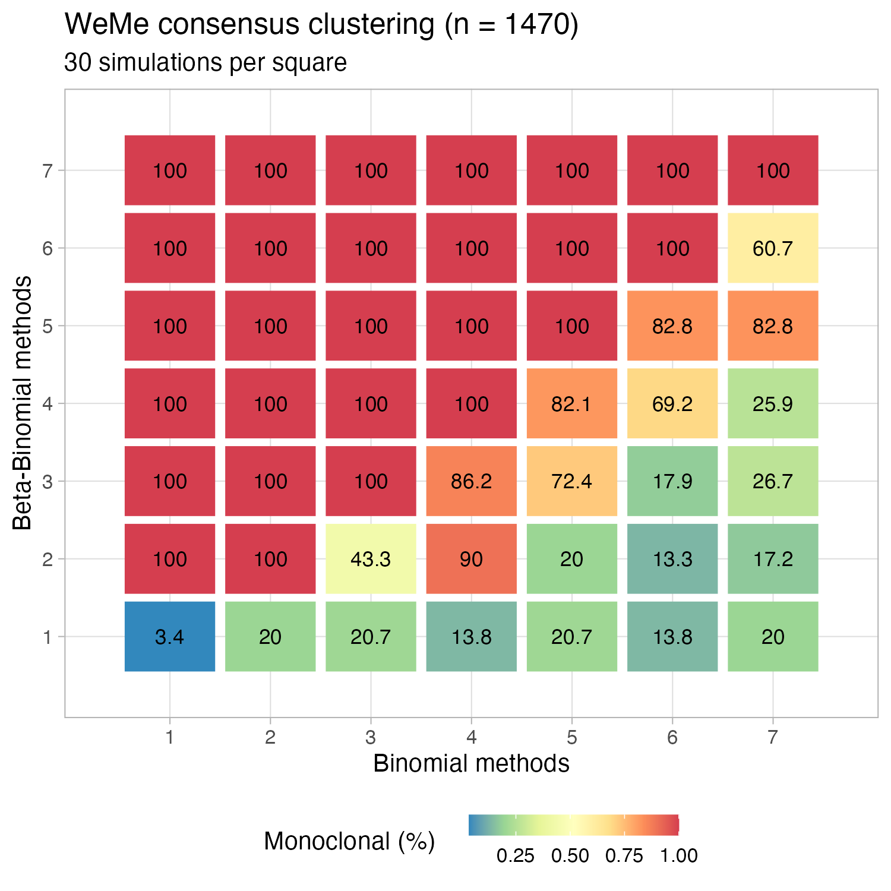

```{r, include = FALSE}
knitr::opts_chunk$set(
  collapse = TRUE,
  comment = "#>"
)
```

This notebook performs PCAWG consensus clustering using [WeMe](https://github.com/morrislab/weme), in the presence of overdispersed WGS data for a tumour with $K=1$ populations (monoclonal tumour). 

The test aims at showing that consensus clustering is substantially affected by the number of methods adopted, and their statistical performance. In particular, we compare Binomial methods that are known to overfit with overdispersed data (i.e., that determine more than a single cluster, $K_B>1$), against Beta-Binomial methods that account for overdispersion and fit properly the number of clusters in the data (i.e., determine $K_{BB}=1$). 

Results show that WeMe determines a number of clusters $K_{WeMe}$ which is determined by the result more frequently returned by the adopted type of method (i.e., $n_B$ overdispersed methods versus $n_{BB}$  non-overdispersed methods). 

We conclude that:

* if WGS counts data are overdispersed and Binomial methods overestimate $K$ ($K_B>K$), 
* whenever more Binomial than Beta-Binomial methods are adopted ($n_B>n_{BB}$),

then WeMe is biased towards overfitting since it determines $K_{WeMe}=2>K$, reporting  polyclonal tumours instead of monoclonal overdispersed clusters.

# Simulated VAF spectrum

We discuss a single-case simulation, and then perform a larger scale analysis.

```{r, message=FALSE, warning=FALSE}
set.seed(1234)

# Used packages
require(dplyr)
require(ggplot2)
require(cowplot)

## scripts for EM and MLE inference

```

We set parameters for a tumour WGS calls set with:

* $1000$ mutations in diploid tumor segments, 

* $100\%$ tumour purity,

* Poisson-distributed coverage with mean depth $45$ (approx. median PCAWG coverage).

```{r, eval=TRUE}
# Overdispersion for a Beta-Binomial model, fixed parameter.
overdispersion = 0.015

# Number of considered mutations
N = 1000

# Coverage, Poisson distributed with mean 45
coverage = rpois(N, 45)
```

The coverage distribution is 
```{r, fig.width=4, fig.height=4}
ggplot(coverage %>% as_tibble) + geom_histogram(aes(value), bins = 100)
```

We sample data from a Beta-Binomial model, where read counts overdispersion is given by the `overdispersion` variable. Since we simulate diploid genome areas for a pure tumour, this means setting the Beta-Binomialmodel success probability to 50%, which corresponds to Cancer Cell Fraction $1$, as expected for clonal mutations.
 
Note that we remove the confounder effect of neutral tail mutations. 
```{r, fig.width=4, fig.height=4}
# Read counts with the variant allele, Beta-Binomial
read_counts_variant_alleles = VGAM::rbetabinom(
  n = N, 
  size = coverage, 
  prob = 0.5, 
  rho = overdispersion
  )

# Tibble for simulated data
simulated_data = data.frame(
  DP = coverage,
  NV = read_counts_variant_alleles
) %>% 
  mutate(VAF = NV/DP) %>% 
  as_tibble()

print(simulated_data)

# Plot VAF
ggplot(simulated_data) + geom_histogram(aes(VAF), binwidth = 0.01)
```

# Read counts clustering

## Binomial model without overdispersion

We know perform Binomial clustering with 2 mixture components (fixed parameters), to replicate the split expected to be caused by overdispersion.
```{r eval=TRUE}
# Fit mixture


```

This are the clustering assignments and fit density for the read counts with the variant.

```{r, fig.width=8, fig.height=4}
# Latent variables hard clustering
pl_1 = BMix::plot_clusters(Binomial_mix,
                           data = simulated_data %>% select(NV, DP) %>% as.data.frame())

# Density per component
pl_2 = BMix::plot_density(Binomial_mix,
                          data = simulated_data %>% select(NV, DP) %>% as.data.frame())

plot_grid(pl_1, pl_2, ncol = 2, nrow = 1)
```

## Beta-Binomial model with overdispersion

We perform the analogous for a Beta-Binomial model with overdispersion, fixing a single clustering component. De fact we are obtaining the maximum likelihood estimate for the overdispersion parameter $\rho$.

```{r eval = TRUE}
# Beta-Binomial clustering with 1 mixture components
BetaBinomial_mix = BMix::bmixfit(
  simulated_data %>% select(NV, DP) %>% as.data.frame(), 
  K.Binomials = 0, 
  K.BetaBinomials = 1,
  score = "BIC"
)

BetaBinomial_mix %>% print
```

We perform the same plot for 
```{r, fig.width=8, fig.height=4}
# Latent variables hard clustering
pl_1 = BMix::plot_clusters(BetaBinomial_mix, 
                    data = simulated_data %>% select(NV, DP) %>% as.data.frame())

# Density per component
pl_2 = BMix::plot_density(BetaBinomial_mix, 
                   data = simulated_data %>% select(NV, DP) %>% as.data.frame())

plot_grid(pl_1, pl_2, ncol = 2, nrow = 1)
```

We dump required data information in the PCAWG-11 format for WeMe. The format in some [example WeMe](https://github.com/morrislab/weme/blob/master/weme_demo/method4/sim0nqeot_subclonal_structure.txt) data is as follows.
```
cluster	n_ssms	proportion
1	1908	0.91203
2	3256	0.153434024446
```

We interpret `proportion` as the Cellular Proportion (CP) obtained by the VAF adjusted for allele-specific CNAs. This is like the CCF, but without the adjustment for tumour purity. 

We note that since this is 100% pure tumour, CCF and CP are exactly the same value. Since the tumour is also diploid, the CCF is twice the simulated VAF.

Binomial results are
```{r}
# Tibble results
toString_Binomial_mix = Binomial_mix %>% BMix::to_string() 
toString_BetaBinomial_mix = BetaBinomial_mix %>% BMix::to_string() 

# PCAWG-11 format
weme_binomial = tribble(
  ~"cluster", ~"n_ssms", ~"proportion",
  1,   toString_Binomial_mix$N_Bin_1, toString_Binomial_mix$Mean_Bin_1,
  2,   toString_Binomial_mix$N_Bin_2, toString_Binomial_mix$Mean_Bin_2
) 

weme_betabinomial = tribble(
  ~"cluster", ~"n_ssms", ~"proportion",
  1,   toString_BetaBinomial_mix$N_BBin_1, toString_BetaBinomial_mix$Mean_BBin_1,
)

# Output files
dir.create("./method1")
dir.create("./method2")

weme_binomial %>% readr::write_tsv("./method1/test_subclonal_structure.txt")
weme_betabinomial %>% readr::write_tsv("./method2/test_subclonal_structure.txt")
```

# WeMe consensus clustering

We evaluate WeMe after inclusion of a simple modification that outputs to disk the output dataframe passed to `ggplot2` by WeMe. The output is saved to file `results.rda`.

This allows us to display the WeMe outputs and their numbers, on top of the default WeMe output which is a PNG figure.

```{r, warning=FALSE}
# Source WeMe
source("weme.R")

# Run WeMe
sids = find_sids()
sids %>% print()

test = genconsensus(sids, rounddown = FALSE)
```

The output numbers by WeMe are
```{r}
load("./results.rda")

result  %>% distinct(phi, method)
```

# PCAWG approach

For single-nucleotide variants clustering, PCAWG adopted several methods based on different types of Dirichlet mixtures:

* `CliP`, `Ccube`, `DPClust`, `PhylogicNDT` and ``PhyloWGS` which use Binomial mixtures;
* `CTPSingle` and `PyClone` which use Beta-Binomial mixtures

Other methods are `ScClust`, which uses splines, or `BayClone-C`, which uses Gaussian mixtures; those are not tested here.


Therefore there are $n_B=5$ Binomial methods, and $n_{BB}=2$ Beta-Binomial methods. Generalising the test discussed in the previous section we generated VAF data with

* number of mutations uniformly distributed in $[500, 1500$];
* coverage uniformly distributed in $[35, 55$];

For the overdispersion, we sampled from the values fit to the tumours discussed in the main text of our letter; the values we sampled from are these

```{r, fig.width=4, fig.height=4}
rho = readRDS('dispersion_PCAWG.rds')

ggplot(as_tibble(rho)) + geom_histogram(aes(value), bins = 100)
```

In the test we simulated a calling process that adopted $n_B=n_{BB}=1, \ldots,7$ Binomial and Beta-Binomial methods; for every configuration we repeated $30$ simulations per value of $n_B$ and $n_{BB}$. Compared to the single-test shown above, here we let solutions with $K_B=1$ and $K_B=2$ compete for every Binomial model. This means that the test factor the uncertainty in the model selection procedure - i.e., whether the Binomial model fits a single cluster or two clusters to data. In practice, this means that even if we test $n_B$ Binomial callers per run, we might have fewer than $n_B$ cases that report two, instead of one, Binomial clusters.

Results from $n=1470$ simulations are shown, where the proportion of tumours - out of 30 per square - that are correctly associated to $K=1$ is reported. 



We observe that the correct model with $K_{WeMe}=1$ is inferred only when $n_B < n_{BB}$ - i.e., more Beta-Binomial than Binomial models are adopted. More importantly, the PCAWG setup ($n_B=2$ and $n_{BB}=5$) shows 10% probability of determining a consensus clustering consistent with a monoclonal tumour, which means that in 90% of the cases the WeMe results are over-estimating the tumour complexity due to the adoption of more Binomial than Beta-Binomial models. 
